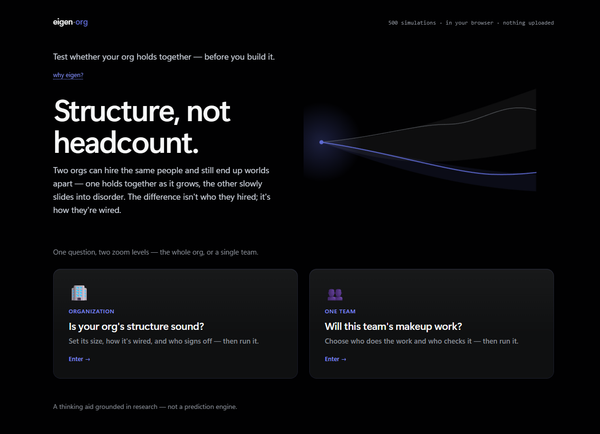
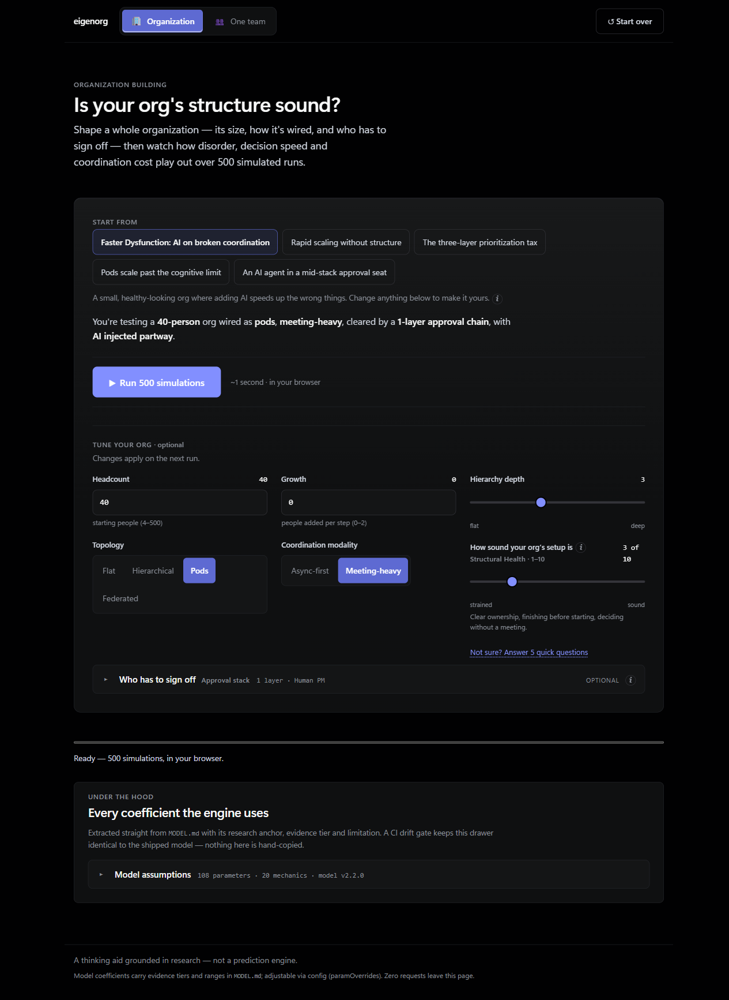
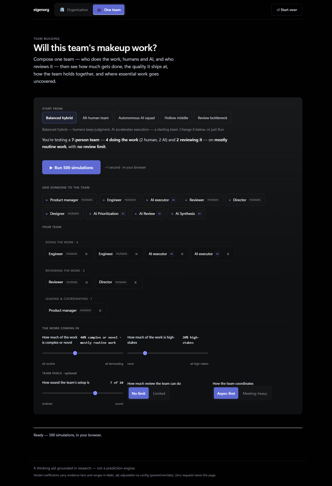
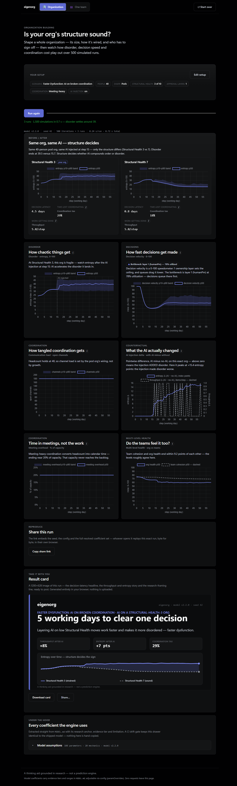
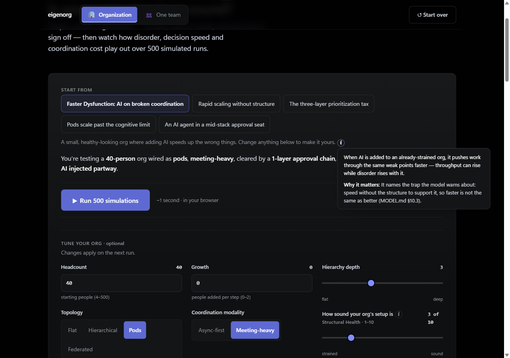

<!-- Pre-publish check: once the repo is public, confirm https://gtm-k.github.io/eigenorg/ resolves and the CI badge renders. -->

# eigenorg

### Structure, not headcount.

Test whether your org holds together — before you build it.

<p align="center">
  
</p>

[](https://github.com/gtm-k/eigenorg/actions/workflows/ci.yml)
[](LICENSE)


Two orgs can hire the same people and still end up worlds apart — one holds together as it grows, the other slowly slides into disorder. The difference isn't who they hired; it's how they're wired. **eigenorg** lets you shape an org, or a single team, run 500 simulations right in your browser, and see whether the structure holds — before you build it.

> A thinking aid grounded in research — not a prediction engine.

---

## What you can do

One question, two zoom levels — the whole org, or a single team.

### Is your org's structure sound?

Shape a whole organization — its size, how it's wired (flat, hierarchical, pods, or federated), how it coordinates, and the chain of sign-offs a decision has to clear — then run it. Start from a named scenario or tune every dial yourself.

<p align="center">
  
</p>

### Will this team's makeup work?

Compose one team — who does the work (humans and AI agents) and who reviews it — then run it. Drag in roles, set how demanding and high-stakes the incoming work is, and see where essential jobs go uncovered.

<p align="center">
  
</p>

### See what structure decides

Every run returns the story as probability ranges across 500 simulations: a before/after entropy comparison, decision latency, coordination cost, meeting overhead, and — for teams — function coverage and the quality of what ships. Each result travels as a shareable link or a downloadable card.

<p align="center">
  
</p>

---

## How it works

- **500 Monte Carlo runs, in your browser.** The simulation engine is written in Rust and compiled to WebAssembly. A full 500-run scenario finishes in about a second — no server, no queue.
- **Nothing leaves the page.** Zero uploads, zero external requests, no analytics, no tracking, no backend. Everything runs on your machine.
- **Every run is reproducible.** The share link embeds the seed, the full config, and the resolved coefficient set — whoever opens it replays that exact run, byte for byte, in their own browser.
- **Ranges, not point predictions.** Outputs are shown as a median line inside a 10th–90th percentile band, so you read a spread of plausible outcomes rather than a single false-precise number.

---

## The model is open

The transparency isn't a footnote — it's the point.

- **One source of truth.** The entire model lives in [`MODEL.md`](MODEL.md): the formulas, every coefficient, and the golden predicates that lock its behavior. The engine's parameters are machine-extracted from that file, so what you read is what runs.
- **Every number is labeled.** Each coefficient carries an evidence tier — `peer-reviewed`, `industry-report`, or `editorial-heuristic` — so you can see exactly how well-supported it is, and adjust the editorial defaults yourself.
- **A built-in assumptions registry.** The app ships an "Every coefficient the engine uses" drawer — a 128-item registry (108 parameters and 20 mechanics), each with its research anchor and stated limitation, generated straight from `MODEL.md`. A CI drift gate keeps it identical to the shipped model; nothing is hand-copied.
- **Golden tests and calibration.** The model's behavior is pinned by golden tests, and its coefficients were calibrated within their research-backed ranges — so changes that would quietly alter what the engine does can't slip through.

<p align="center">
  
</p>

---

## Quickstart

**Try it:** open **https://gtm-k.github.io/eigenorg/** and pick a door.

**Run it locally:**

Prerequisites — [Rust](https://rustup.rs) (the pinned toolchain and `wasm32-unknown-unknown` target are picked up automatically), `wasm-pack` (`cargo install --locked wasm-pack`), and Node.js 22+ (`npm install` — dev tooling only; nothing npm-installed ships to the site).

```sh
bash scripts/build.sh        # Rust -> WebAssembly, and vendor Chart.js into www/
node scripts/serve.mjs 8080  # serve at http://localhost:8080/eigenorg/
```

Then open <http://localhost:8080/eigenorg/>.

---

## Is this a prediction engine?

No. eigenorg is **a thinking aid grounded in research — not a prediction engine.**

It encodes well-supported qualitative laws — communication channels grow quadratically with team size, hierarchy layers add decision latency, structure mirrors into what an org ships, and hybrid human–AI teams beat fully autonomous ones on complex work. It returns ranges you can reason with, and the exact coefficients are adjustable and labeled by how well-supported they are.

Use it to pressure-test a structural decision before you commit to it — not to forecast a number.

---

## License

MIT © 2026 Gowtham Kethineedi. See [LICENSE](LICENSE).
